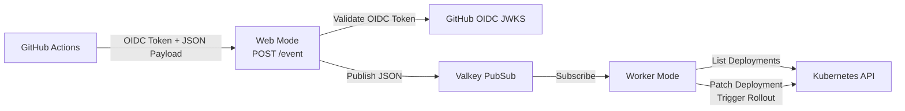

# Architecture

## Overview

The system consists of two runtime modes packaged in a single Go binary:

1. **Web Mode** — An HTTP server that receives authenticated webhook events from GitHub Actions and publishes them to Valkey PubSub.
2. **Worker Mode** — A subscriber that listens for events on Valkey PubSub and triggers rollout restarts for matching Kubernetes Deployments.

The design principal here is separating the application that receives the callbacks from GitHub from the component that has administrative access to modify the Kubernetes cluster through a messaging channel provided by Valkey.

## Architecture Diagram



## Component Details

### Web Mode

The web mode exposes two HTTP endpoints:

- `POST /event` — Receives authenticated webhook events
- `GET /healthz` — Health check endpoint

**Request flow:**

1. GitHub Actions workflow sends a POST request with an OIDC Bearer token and a JSON payload specifying the updated image.
2. The web server validates the OIDC token:
   - Verifies the JWT signature against GitHub's JWKS endpoint
   - Validates standard claims (exp, iat, nbf)
   - Checks that the audience matches the configured value (`GITHUB_OIDC_AUDIENCE`)
   - Enforces that the `repository_owner` claim matches the configured allowed organization (`GITHUB_ALLOWED_ORG`)
3. The JSON payload is validated:
   - Strict schema validation (unknown fields are rejected)
   - The `image` field must start with the configured allowed prefix (`ALLOWED_IMAGE_PREFIX`))
   - The `tag` field must be non-empty
4. On success, the payload is published to the configured Valkey PubSub channel and HTTP 202 (Accepted) is returned.

**Security considerations:**

- Authentication material (OIDC tokens) is never forwarded to Valkey
- Only the validated JSON payload is published
- JWKS keys are cached with a 1-hour TTL to reduce external calls
- Request payloads are limited to 1MB

The core security architectural assumption here is that the only action that the web component can send to the worker component is a signal to restart deployments. Therefore if the web frontend or Valkey components are compromised the security boundary for interacting with the Kubernetes cluster is enforced by the worker as the only component that has permissions to modify the running cluster.

### Worker Mode

The worker mode subscribes to a Valkey PubSub channel and processes incoming events:

1. Receives a JSON message from the Valkey channel
2. Validates the message payload (same schema validation as web mode)
3. Constructs full image references for each tag (`image:tag1`, `image:tag2`, etc.)
4. Lists all Deployments across accessible namespaces
5. Finds Deployments with containers whose image **exactly** matches any of the event image references
6. Patches each matching Deployment's pod template annotations to trigger a rollout restart

**Matching rules:**

- Image references are constructed as `event.image + ":" + tag` for each tag in the `tags` array
- Container images must match exactly (no prefix or wildcard matching)
- Multiple Deployments across multiple namespaces can match a single event
- A single Deployment is only restarted once even if it matches multiple tags

**Restart mechanism:**

- The worker patches the Deployment's `spec.template.metadata.annotations` with `kubectl.kubernetes.io/restartedAt` set to the current UTC timestamp
- This triggers a rolling update identical to `kubectl rollout restart`

### Valkey

Valkey is used as a PubSub message broker between the web and worker components. It provides:

- Decoupling between the webhook receiver and the cluster restarter
- The ability to run multiple workers subscribing to the same channel
- Simple infrastructure with no persistence requirements

**Important:** Valkey PubSub is fire-and-forget. Messages are not persisted, so if the worker is not connected when a message is published, the message is lost. This is acceptable for development environments where occasional missed events can be handled via manual restarts or a subsequent deployment.

## Data Flow

### Event Payload

The JSON payload published to Valkey matches the request payload:

```json
{
  "image": "ghcr.io/unitvectory-labs/myservice",
  "tags": ["dev"]
}
```

When multiple tags are specified:

```json
{
  "image": "ghcr.io/unitvectory-labs/myservice",
  "tags": ["v1.0.0", "v1.0", "v1", "latest"]
}
```

## Security Model

1. **Authentication**: GitHub Actions OIDC tokens are validated against GitHub's JWKS endpoint with signature verification, audience matching, and organization restriction.
2. **Authorization**: Only tokens from the configured GitHub organization are accepted. The `repository_owner` claim is used to enforce this.
3. **Payload validation**: Strict JSON schema validation prevents injection of unexpected fields. Image prefixes are restricted to the configured allowed prefix.
4. **Transport**: No authentication material is passed to Valkey. Only the validated JSON event payload is published.
5. **Kubernetes RBAC**: The worker uses a dedicated service account with least-privilege permissions (get, list, watch Deployments, and patch for restart).

## Dev Mode

For local development and testing, a dev mode (`--dev-mode` flag or `DEV_MODE=true` environment variable) is available for the web mode. In dev mode:

- OIDC signature verification is disabled (tokens are parsed but not cryptographically verified)
- Organization restriction is still enforced
- All other validation (payload schema, image prefix) remains active

**Warning:** Dev mode must never be used in production environments.
